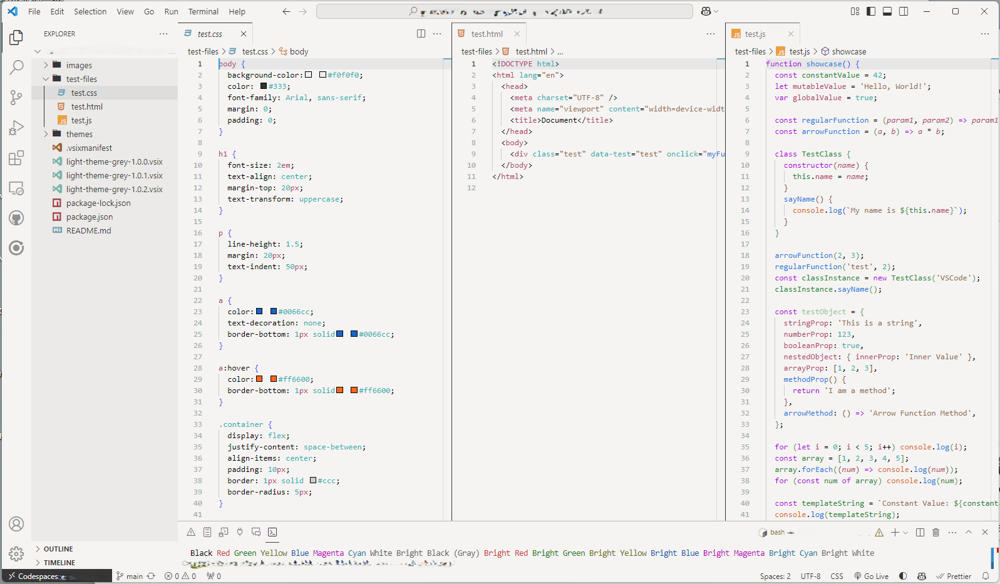

# Light Theme Grey

A clean, minimal light grey theme for Visual Studio Code.

## ✨ Modern UI Customization

Want the modern "floating panel" look with rounded corners and shadows (inspired by the latest VS Code experiments)?

Check out our [Custom CSS Guide](CUSTOM_CSS.md) to learn how to enhance this theme with custom UI effects.

## 🚀 Getting Started

1. Install this theme from the VS Code Marketplace.
2. Open **Command Palette** (`Ctrl+Shift+P` / `Cmd+Shift+P`).
3. Select **Preferences: Color Theme**.
4. Choose **Light Theme Grey**.
